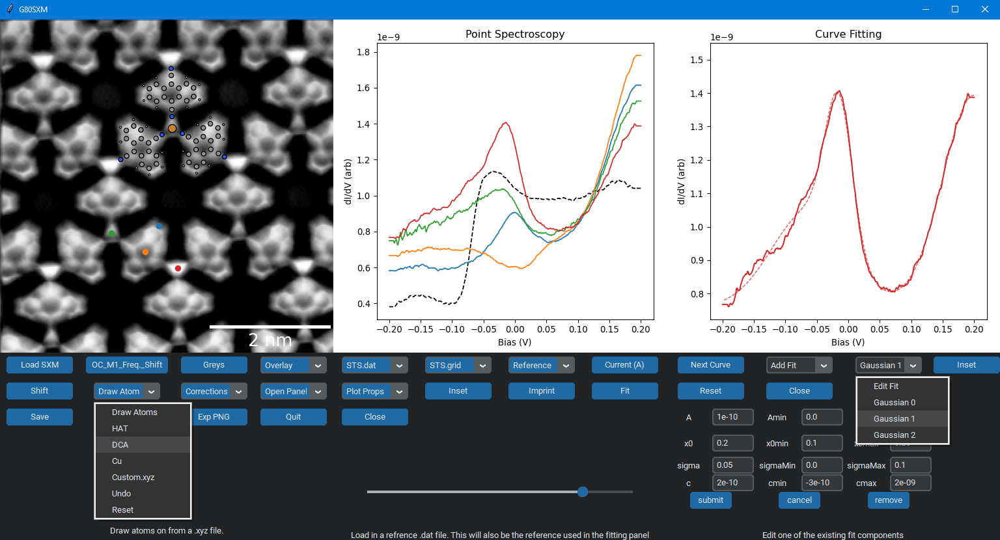
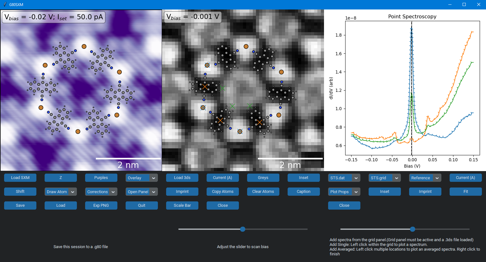
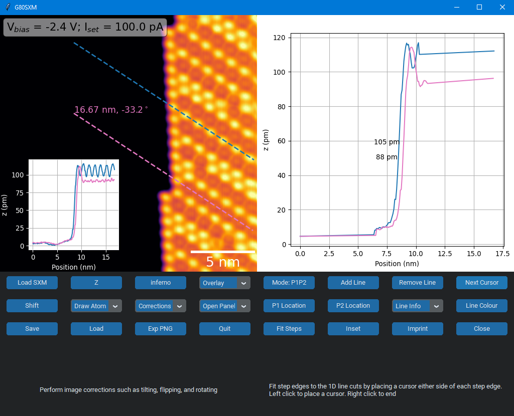
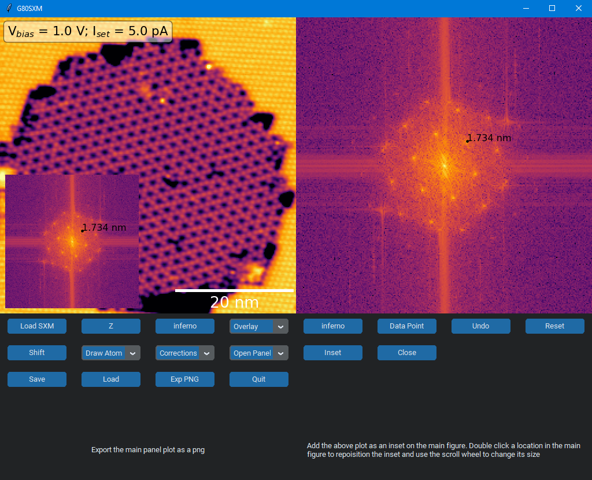
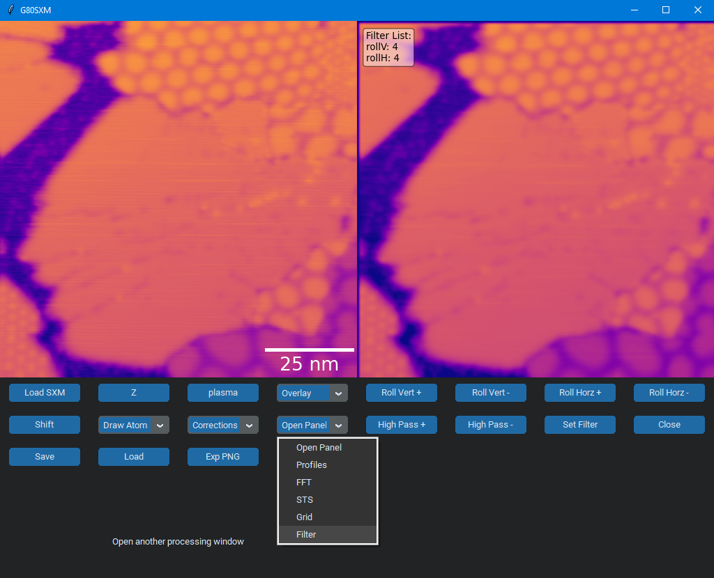

# G80SXM
G80SXM is a tool written in python to quickly analyse and create figures for Nanonis SPM data (STM/STS/nc-AFM).
I am actively developing this tool so if you have any suggestions or find any bugs, feel free to create an issue. The provided ./ExampleData used to create these figures was obtained in our lab at Monash University (see publications [here](https://onlinelibrary.wiley.com/doi/abs/10.1002/adfm.202106474) and [here](https://pubs.acs.org/doi/abs/10.1021/acsnano.9b05950)).

# Installation
clone the repository and run 'pip install .' from the root directory

To run: python gui.py

# Usage
There are a number of panels in the gui, each with a specific function. See below figures for some examples. Hovering over buttons in the GUI will also provide help. Sessions can be saved and loaded via '.g80' files so you can pick up where you left off.

* Easily overlay atoms with correct scaling from custom .xyz files
* Automatically or manually locate markers on the main figure that correspond to spectrum locations
* Quickly fit spectra with
  * Reference curves/Other STS curves
  * Gaussian
  * Fermi-Dirac
  * More

* Visualise grid data from .3ds files (middle panel)
* Easily pull out individual curves from a grid
* Ability to average curves from several pixels within a grid. In this example, each spectrum plotted is an average of three spectra from the middle panel as denoted by the blue, orange and green crosses

* Plot multiple 1D cuts through data
* Label and colour line cuts
* Fit profiles to accurately determine step edge heights
* Easily add, position, and style inset figures

* View FFT and label peaks

* Apply rolling and high-pass filters
* More filters being added soon
